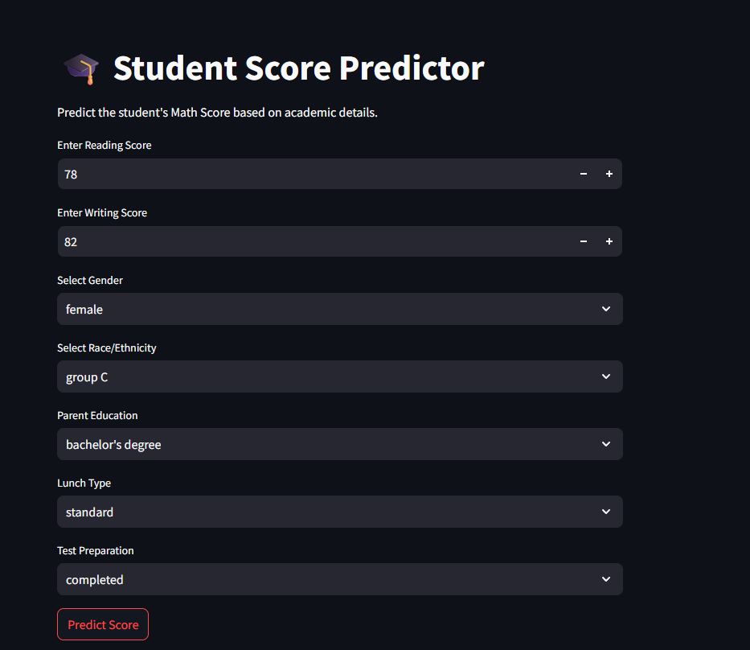
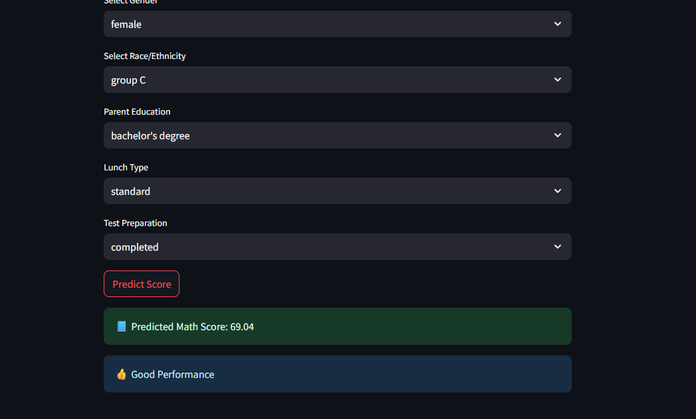

# 🎓 Student Score Predictor | ML Web App

A Machine Learning based **Student Score Prediction Web Application** built using **Python, Scikit-learn, and Streamlit**.

This project predicts a student's **Math Score** based on academic and demographic features such as reading score, writing score, gender, lunch type, parental education, and test preparation status.

---

## 🚀 Live Project Overview

This project demonstrates an **end-to-end Machine Learning workflow**:

* 📊 Data Preprocessing
* 🧹 Feature Engineering
* 🤖 Model Training
* 💾 Model Saving using Joblib
* 🌐 Streamlit Web App Deployment

Perfect for **ML beginners, academic assignments, and resume projects**.

---

## 🛠️ Tech Stack

* **Python**
* **Pandas**
* **Scikit-learn**
* **Joblib**
* **Streamlit**
* **Jupyter Notebook**

---

## 📂 Project Structure

```text
DSA-Assignment-ML-WEBapp/
│
├── data/
│   └── student_scores.csv
│
├── models/
│   └── student_score_model.joblib
│
├── notebooks/
│   └── model_training.ipynb
│
├── webapp/
│   └── app.py
│
└── README.md
```

---

## 📥 Input Features

The app takes the following inputs:

| Feature          | Type     |
| ---------------- | -------- |
| Reading Score    | Numeric  |
| Writing Score    | Numeric  |
| Gender           | Dropdown |
| Race/Ethnicity   | Dropdown |
| Parent Education | Dropdown |
| Lunch Type       | Dropdown |
| Test Preparation | Dropdown |

---

## 📤 Output

The app predicts:

* 🎯 **Math Score**
* 📈 **Performance Category**

  * Excellent
  * Good
  * Average
  * Needs Improvement

---

## 🖼️ Input Screen




Example display:

```text
Reading Score = 85
Writing Score = 88
Gender = Female
Lunch = Standard
```

---

## 🖼️ Output Screen



Example output:

```text
📘 Predicted Math Score: 78.56
👍 Good Performance
```

---

## 📸 Screenshots

> Create a folder named `images` in your repo and upload screenshots.

```text
images/
   ├── input_screen.png
   └── output_screen.png
```

Then use:

```markdown


```

---

## ▶️ How to Run

Clone the repository:

```bash
git clone https://github.com/Sakshikeware2647/DSA-Assignment-ML-WEBapp.git
cd DSA-Assignment-ML-WEBapp
```

Install dependencies:

```bash
pip install -r requirements.txt
```

Run Streamlit app:

```bash
streamlit run webapp/app.py
```

---

## 🎯 Features

* User-friendly UI
* Real-time score prediction
* ML model integration
* Performance category display
* Beginner-friendly project structure

---

## 💡 Future Improvements

* Model accuracy comparison
* Better UI styling
* Cloud deployment
* Student performance analytics dashboard

---

## 👩‍💻 Author

**Sakshi Keware**
MCA Student | Machine Learning Enthusiast | Web App Developer
